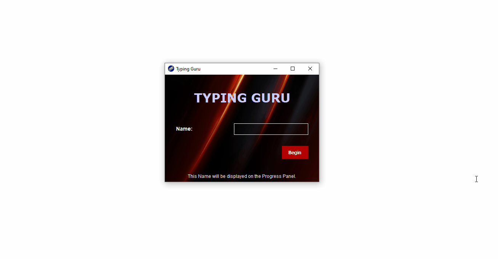

# Typing Software

Typing Software build on java, uses key events and java swing. Typical typing app for practice and monitoring your progress, measures metrices like correct words, total time, and speed.

### Requirements:
- JDK to run Compiled jar file.
- Java IDE (Neatbeans,etc for compiling source code)

you can download executable jar file from here [Typing Software](https://github.com/Tushark21/Java-Projects/tree/master/Typing%20Tutor/src/jar)
### DEMO:

